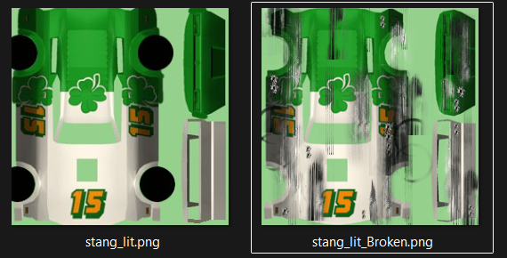

# Cars UBR files

This file contains cars textures and meshes.

Example of extracted textures:

## Data

In a map file, the data order will always be the same: 

| File header |
|-|
Mesh table
mesh data
Textures
Texture table

### File header

| FROM | TO | SIZE | TYPE | DESCRIPTION |
|-|-|-|-|-|
0x00 | 0x03 | 4 | UINT32_T | File type
0x04 | 0x07 | 4 | UINT32_T | Ptr to texture table headers without the file header padding
0x08 | 0x09 | 4 | UINT32_T | Ptr to texture table headers
0x0C | 0x0F | 4 | STRING | File name

File type

| VALUE | TYPE |
|-|-|
0x20000000 | MAP
0x20010000 | CAR
0x00030000 | FONT
0x00050003 | MENU
0x00050004 | TEXTS
0x04090000 | IN_GAME
0x00050001 | SPRITES
0x000C0001 | CAR_DATA