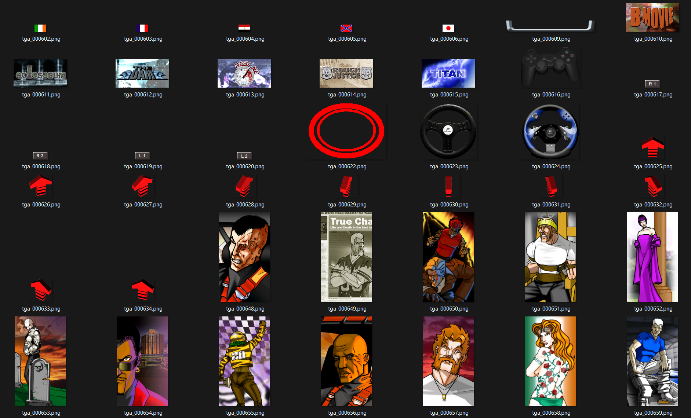

# Flash UBR file (menus)

Example of extracted textures:

## Data

There is two texture lists, the first one is uncompressed textures and the second one uses a 256 colors palette.

In this file, he data order will be this: 

| File header |
|-|
Unkown data
Textures headers
Textures data
Textures headers
Textures data
Palette

Currently the position of the texture header lists are hardcoded in the code, looks like it's a pain to find the address with code. (Address of the Europe version, SCES_507.81)