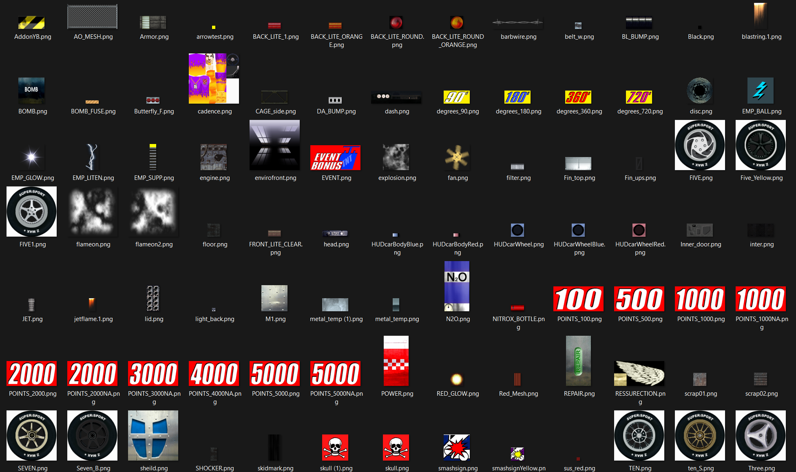

# InGame UBR file

This file contains power ups textures and their meshes and some other textures.

Example of extracted textures:

## Data

In this file, he data order will be this: 

| File header |
|-|
Textures
Mesh table and data multiple time
Texture table and unkown data multiple time
