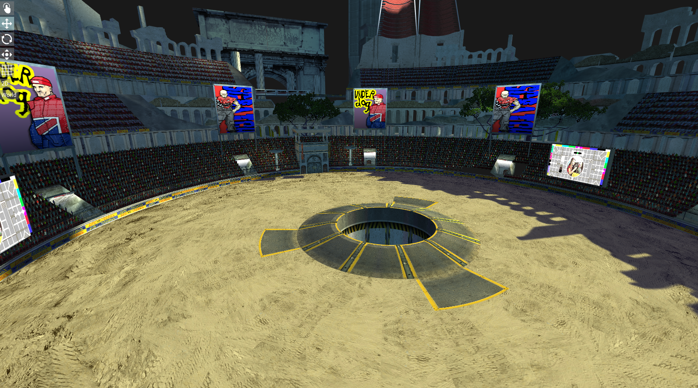
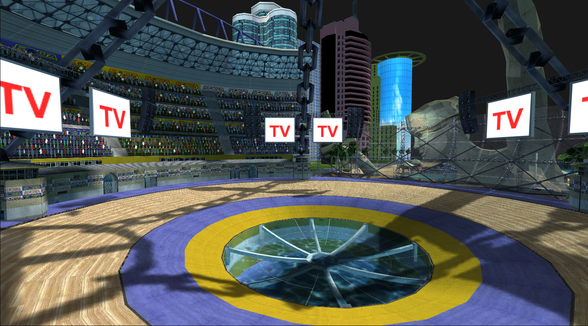
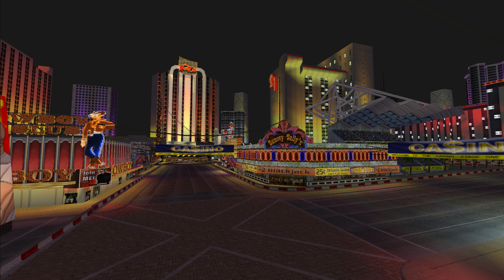

# Presentation

I'm currently working on a tool (code not published yet since I'm cleaning it before) to extract data from the Destruction Derby Arenas PS2 game made by Studio 33 in 2004.

I'm documenting my researches if other people are interested by data extraction.

Currently I'm able to extract every textures of the game and save them as PNG files and I can extract maps meshes and save them as FBX files (not perfect, still work in progress).
I'm not able to extract power ups meshes. 

[GitHub of the project](https://github.com/Fewnity/DDA-Asset-Extractor)

Pictures of some extracted maps:

## Contact:

If you want to talk about this project, you can reach me with:

**Discord:** fewnity

**Email:** fewnity@gmail.com

**LinkedIn:** [https://www.linkedin.com/in/gregory-machefer-grimaud/](https://www.linkedin.com/in/gregory-machefer-grimaud/)