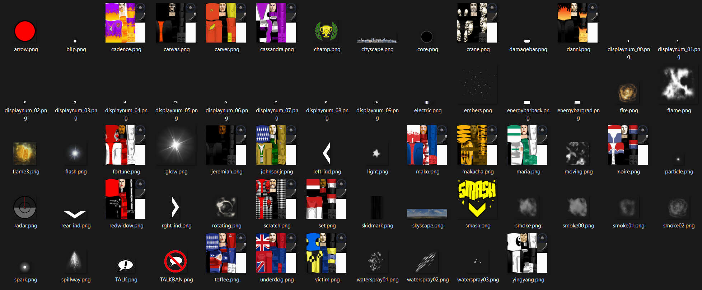
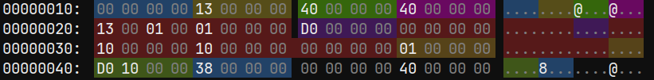
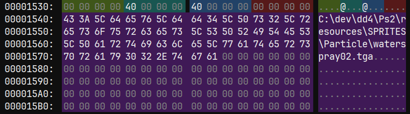

# Sprites UBR file

This file contains only textures.

It's containing player skins, particules and some UI.

Example of extracted textures:



## Data block header

| FROM | TO | SIZE | TYPE | DESCRIPTION |
|-|-|-|-|-|
0x00 | 0x03 | 4 | UINT32_T | File type
0x04 | 0x07 | 4 | UINT32_T | Next texture entry header address
0x08 | 0x09 | 4 | UINT32_T | Size of SPRITES.UBR in bytes
0x0C | 0x0F | 4 | NONE | Empty

## Data

This file does not contain a texture table with every entries following each other. It's one one data block header, then one texture table entry, then one texture header, then the actual texture data and then it's starts again with a texture table entry.

Here is how a texture entry looks like in a file:<br>
(Red part is unknown and black part is not part of the struct).



```c++
struct TextureTableEntry
{
	uint32_t mipmapCount;          // Mipmap count, but weird value if it's an animated texture
	ClutType clutType;             // Palette type : 19 = 256 colors, 20 = 16 colors
	uint32_t width;                // Texture width in pixel with the mipmap included
	uint32_t height;               // Texture height in pixel with the mipmap included
	uint32_t unknown0;             // Unknown, not an unique value, id in the next table?
	uint32_t unknown1;             // Always 1
	uint32_t texturePosition;      // Generally it's a relative position in the file
	uint32_t unknown2;             // Always 0
	uint32_t unknown3;             // Unknown, not const (seen values: 16, 32) 32 only seen in winbowl
	uint32_t unknown4;             // ??? = 16 * clutCount, not true if unknown3 is not egals to 16
	uint32_t unknown5;             // Always 0
	uint32_t clutCount;            // Palettes count
	uint32_t palettePosition;      // Generally it's a relative position in the file
	uint32_t textureInfosPosition; // Generally it's a relative position in the file + 0xF to get the file name
	// There is the width, height (without the mipmap) and the texture name in the texture infos
};
```

Here is how a texture hader looks like in a file:<br>



```c++
struct TextureHeader
{
	uint32_t unkown0;
	uint32_t width; // Texture width in pixel without the mipmap
	uint32_t height; // Texture height in pixel without the mipmap
	uint32_t unkown1;
	char filePath[0x80]; // Texture file path, not always present
};
```