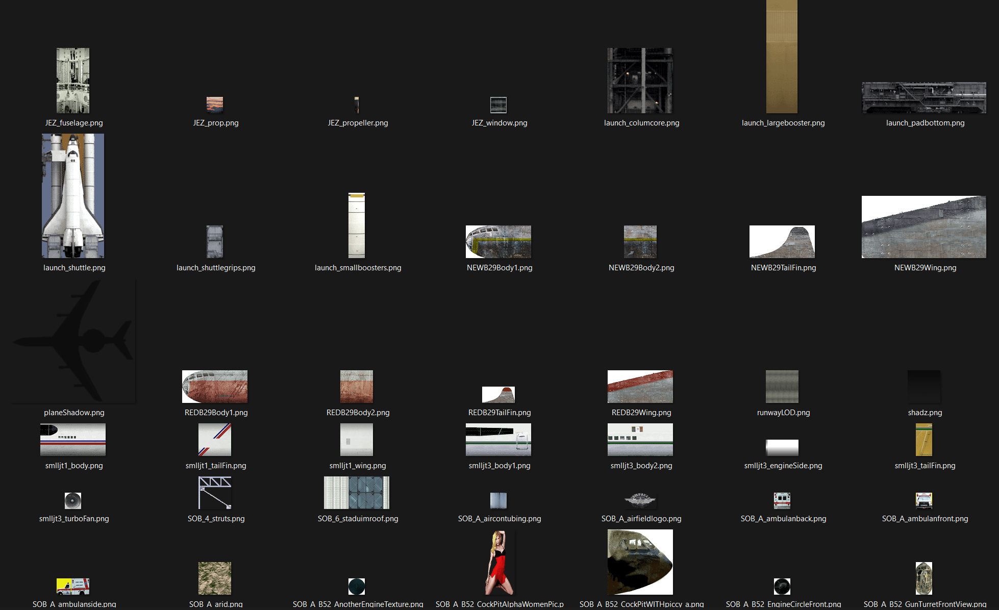
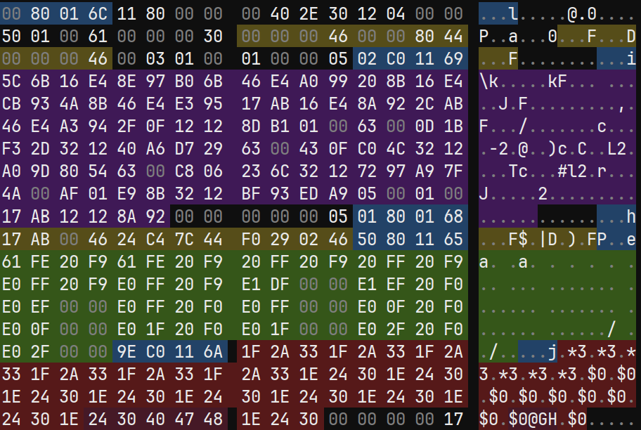

# Tracks

Files located in the TRACKS folder.

They contain maps textures, meshes, collisions data, probably navigation meshes and culling informations.

Currently the tool can extract textures and meshes.

Example of extracted textures:



## Data

In a map file, the data order will always be the same:<br>

| File header |
|-|
Mesh table
mesh data
Textures
Texture table

### File header

| FROM | TO | SIZE | TYPE | DESCRIPTION |
|-|-|-|-|-|
0x00 | 0x03 | 4 | UINT32_T | File type
0x04 | 0x07 | 4 | UINT32_T | Ptr to skybox meshes and textures data
0x08 | 0x09 | 4 | UINT32_T | Ptr to texture table headers
0x0C | 0x0F | 4 | STRING | File name

File type

| VALUE | TYPE |
|-|-|
0x20000000 | MAP
0x20010000 | CAR
0x00030000 | FONT
0x00050003 | MENU
0x00050004 | TEXTS
0x04090000 | IN_GAME
0x00050001 | SPRITES
0x000C0001 | CAR_DATA

### Mesh table

There are two lists of data.

In the first list (something like a list of object), each entry has :<br>
An address to a list of pair to map gpu packets with a texture,<br>
A number of pair,<br>
And an address that I don't understand the data it's pointing to.<br>

```cpp
struct ParentDrawCommandEntry
{
	uint32_t vifPacketTexturePairCount;
	uint32_t pairListAddress;
	uint32_t unkownAddress;
};
```

The list of pair is composed of a Vif packet list address and an index of texture.

Currently I don't know if there is a way to get the number of vif packet in the list.<br>
Every packets in the list are drawn with the same texture. The texture index references a texture in the texture table.<br>

```cpp
struct PacketAndTextureEntry
{
	uint32_t vifPacketListAddr;
	uint32_t textureIndex; // Texture index that is used by the vif packet list
};
```

### Mesh data

A mesh is composed of many vif packets. A vif packet can draw only few triangles.

Every vif packet list starts with a header that like that:

```
BA 01 00 60 00 00 00 00 00 00 00 00 00 00 00 14
```

The first two bytes times 16 are the size in byte of the list (without the header). The last byte is unknown.

A vif packet looks like this:



- Blue parts are VIF UNPACK commands. This command tell the cpu to send data to the gpu memory.

- The first yellow part is the position and the scale (at the same time) of the triangle batch. (3 floats).

- The second yellow part is the position but substracted to the other position. (3 floats).

- Purple parts contains all the vertices positions. 3 uint16_t per vertex.

- Green parts contains all the vertices UVs. 2 uint16_t per vertex.

- Red parts contains all the vertices colors.

- The first uncolored parts contains the GIF tag. Other uncolored parts are unknown. 3 uint8_t per vertex.

The batch is made of multiple triangles strip. See [Triangle Strip on Wikipedia](https://en.wikipedia.org/wiki/Triangle_strip).

A new triangle strip starts when the first bit of the vertex UVs is set to 1.

### Textures

In files you can find something like this:

```cpp
00 00 00 00 80 00 00 00 80 00 00 00 00 00 00 00 
2F 2F 55 74 69 6C 69 74 79 2F 65 2F 73 6F 75 72
63 65 49 6D 61 67 65 73 2F 67 6C 61 64 61 74 69
6F 46 69 6E 61 6C 2F 53 4F 42 5F 32 5F 70 69 6C
6C 61 72 62 61 73 65 2E 74 67 61 00 00 00 00 00
```

the string version of this is: 
`//Utility/e/sourceImages/gladatioFinal/SOB_2_pillarbase.tga`

In the first 16 bytes there are two informations about the texture.<br>
The width in pixel [0x4, 0x7] and the height in pixel [0x8, 0x11].

0xB0 (176) bytes after this block, there is the actual texture data. The data is compressed using a texture palette.

The palette is directly at the end of the texture data.

There is two type of palette, 256 colors (1024 bytes) or 16 colors (64 bytes). 

The palette data is "swizzled" and should be "unswizzled". I tried to explain it in a comment:
- 8 first colors are correct
--- (For every next 32 colors 8 times)
--- The 16 next colors are in the wrong order (need to swap 8 colors first color with the 8 next one)
--- Then 16 next colors are correct (only the next 7 times)
- 8 last colors are correct

Once palette data is fixed, the palette can be used to create the final texture.

### Skybox texture table

### Texture table

At the texture table address you will have the table header, something like that:
```c++
01 01 00 05 40 75 00 00 90 84 01 00 47 6C 61 64
20 00 00 00 B8 11 00 00 E0 11 00 00 CC 03 00 00
```

The `20 00 00 00` value from [0x10, 0x13] is the texture table position offset starting from 0x10.
The `B8 11 00 00` value from [0x14, 0x17] is the texture table size in bytes.

Each entry has all the necessary information to extract the texture. There are some unknown values but looks like they are not useful for us.

```c++
struct TextureTableEntry
{
	uint32_t mipmapCount;          // Mipmap count, but weird value if it's an animated texture
	ClutType clutType;             // Palette type : 19 = 256 colors, 20 = 16 colors
	uint32_t width;                // Texture width in pixel with the mipmap included
	uint32_t height;               // Texture height in pixel with the mipmap included
	uint32_t unknown0;             // Unknown, not an unique value, id in the next table?
	uint32_t unknown1;             // Always 1
	uint32_t texturePosition;      // Generally it's a relative position in the file
	uint32_t unknown2;             // Always 0
	uint32_t unknown3;             // Unknown, not const (seen values: 16, 32) 32 only seen in winbowl
	uint32_t unknown4;             // ??? = 16 * clutCount, not true if unknown3 is not egals to 16
	uint32_t unknown5;             // Always 0
	uint32_t clutCount;            // Palettes count
	uint32_t palettePosition;      // Generally it's a relative position in the file
	uint32_t textureInfosPosition; // Generally it's a relative position in the file + 0xF to get the file name
	// There is the width, height (without the mipmap) and the texture name in the texture infos
};
```

